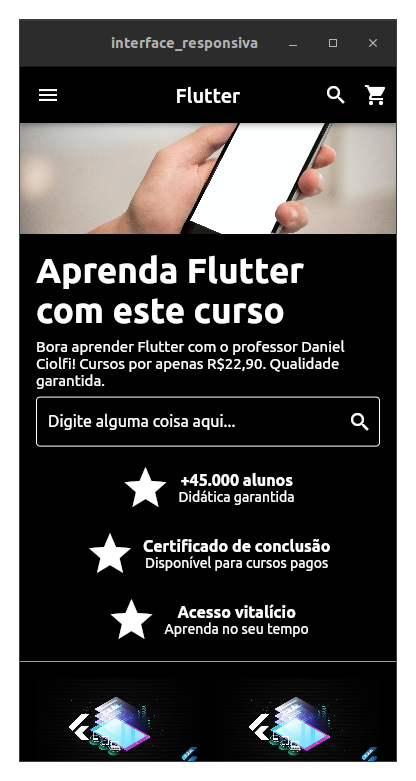
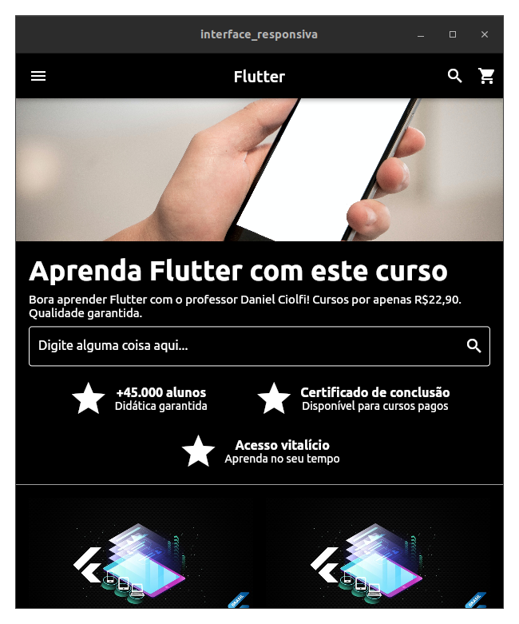
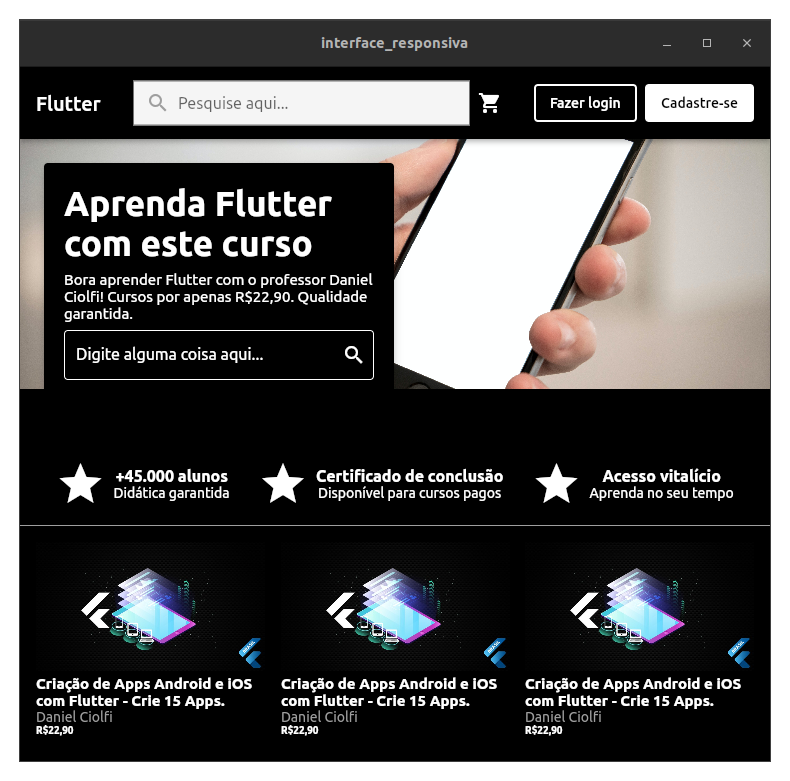
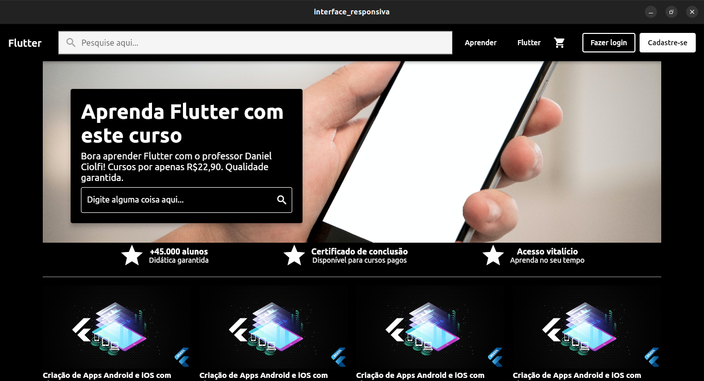

# interface_responsiva_1

Um clone da interface do site "Udemy.com" responsiva para desktop, mobile e web.

## Sobre o Projeto

Este projeto foi realizado como a PRIMEIRA PRÁTICA do curso de [Responsividade no Flutter | Mobile, Tablet, Web e Desktop](https://www.udemy.com/course/responsividade-flutter/) do instrutor Daniel Ciolfi no site da Udemy.

### O projeto têm os seguintes objetivos:

- Treinar as habilidades adquiridas dentro do curso, criando um clone da interface responsiva da plataforma de ensino online Udemy.com. 
- Práticar os conhecimentos sobre responsividade no Flutter e uso dos Widgets, como: Flexible/Expanded, Column/Row, ListView/GridView e entre outros vários widgets abordados no curso.
- Explorar a separação de Widgets Personalizados, em seções, para cada tipo de plataforma. Por exemplo, a separação da AppBar para 3 tipos de Widgets Personalizados, que são: mobile_app_bar.dart, web_app_bar.dart e  web_app_bar_content_responsive.dart.

## Imagens do projeto

A interface produzida neste projeto em diversos tipos de plataformas.

* Mobile:

* Tablet:

* Web:

* Desktop:

## Contato

Para contato, informações ou sugestôes acesse aos links abaixo:

 
  
  
   

